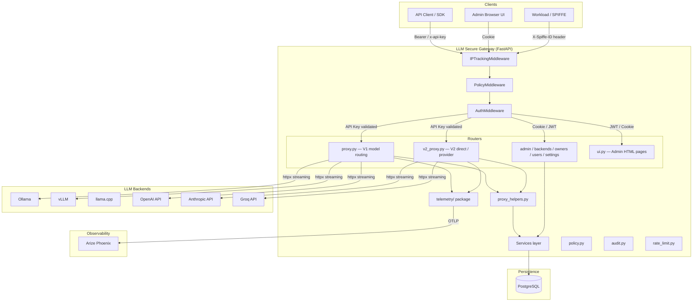
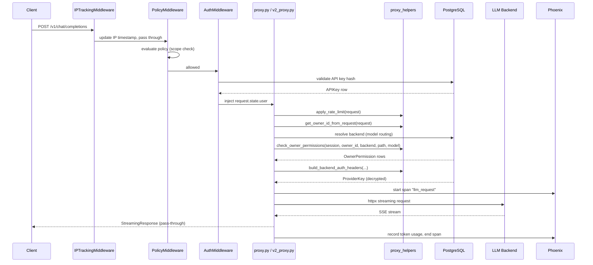
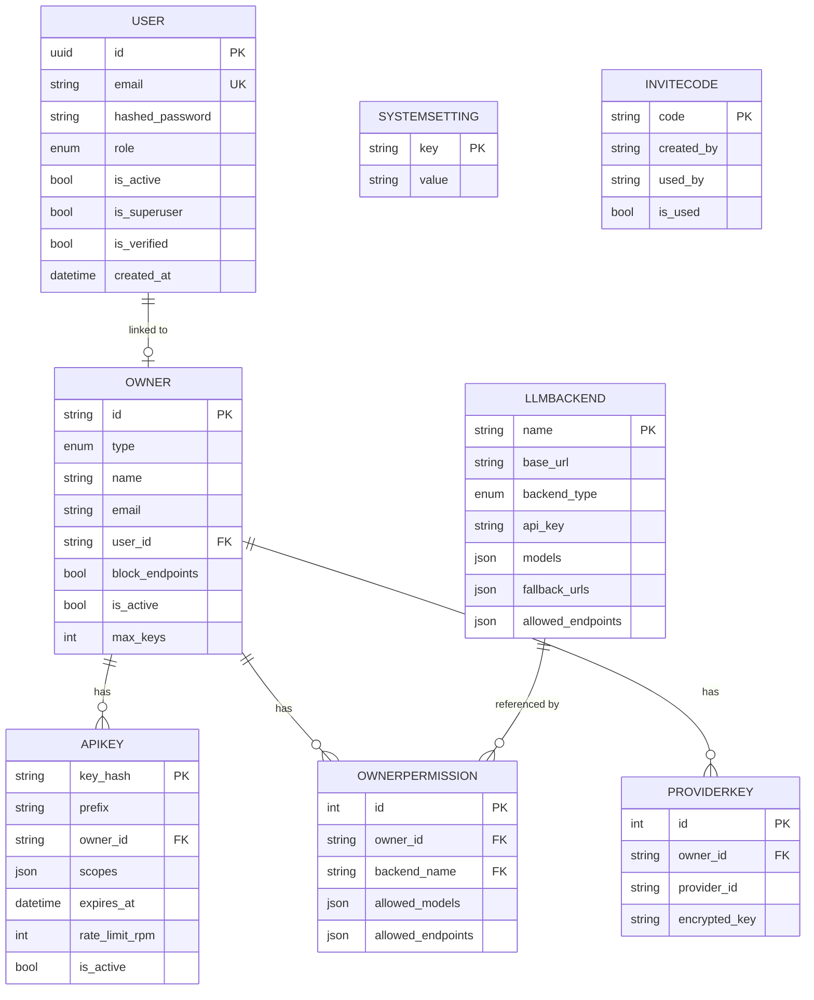

# Architecture

## Overview

The LLM Secure Gateway is a FastAPI monolith acting as a secure reverse proxy in front of one or more LLM backends (Ollama, vLLM, llama.cpp, OpenAI, Anthropic, Google, Groq, or custom). It enforces authentication, rate limiting, policy, and per-owner permissions before forwarding requests, and emits structured traces to Arize Phoenix.

---

## System Architecture



---

## Request Flow — Proxy Call



---

## Resilience & Granular Quarantining

The gateway implements multi-tier resilience across proxies:
- **Per-URL Circuit Breaking**: `CircuitBreaker` trips after 5 consecutive transport failures.
- **Granular Model Quarantining**: Rather than failing an entire multi-model cluster node, failing `(backend, model)` routes enter a temporary quarantine window:
  - `401 / 403` (Quota/Auth failure): 1-hour cooldown (`QUARANTINE_FORBIDDEN`)
  - `429` (Rate limiting): 5-minute cooldown (`QUARANTINE_RATE_LIMIT`)
  - `503` (Overload / slot exhaustion): 1-minute cooldown (`QUARANTINE_OVERLOADED`)
  - `500 / 502 / 504` (Server crash / internal error): 30-second cooldown (`QUARANTINE_SERVER_ERR`)
- **Cross-Provider Failover Chains**: Evaluates prioritized fallback targets, automatically bypassing any targets currently in cooldown quarantine.

---

## Middleware Chain

Middleware is applied in this order (innermost executes first):

| Order | Class | Purpose |
|---|---|---|
| 1 (outermost) | `IPTrackingMiddleware` | Records client IP + last-seen timestamp |
| 2 | `CSRFMiddleware` | Double-submit cookie CSRF protection for `/admin` and `/auth` POST/PUT/DELETE |
| 3 | `PolicyMiddleware` | Evaluates scope policy; writes to audit log |
| 4 (innermost) | `AuthMiddleware` | Validates API key or passes cookie-auth to router |

Routes exempt from `AuthMiddleware`: `/`, `/health`, `/docs`, `/openapi.json`, `/admin/*`, `/auth/*`.

---

## Service Layer

```
services/
├── config_service.py    ConfigService     — LLM backend CRUD, system settings read
├── auth_service.py      AuthService       — API key creation, validation, revocation
├── owner_service.py     OwnerService      — Owner CRUD, provider key encrypt/decrypt
├── email_service.py     EmailService      — SMTP transactional email (welcome, reset, alerts)
└── federation_service.py FederationService — Background loop: poll backends, update model lists
```

All services are singletons instantiated at module import time and exposed via `get_*_service()` dependency functions. `OwnerService` raises `RuntimeError` at startup if `ENCRYPTION_KEY` is not set.

---

## Database Schema



---

## Routing Strategies

### V1 — Model-Based (Auto-Routing)

Requests to `/{path}` are routed by matching the `model` field in the request body against registered backends.

| Setting | Behaviour |
|---|---|
| `ENABLE_EXPERIMENTAL_ROUTING=false` (default) | First backend that lists the model wins |
| `ENABLE_EXPERIMENTAL_ROUTING=true` | Random load-balance across all matching backends |

### V2 — Direct Routing

`/direct/{backend_name}/{path}` — routes to the named backend explicitly. Bypass model-based selection.

### V2 — Provider Routing

`/provider/{provider}/{path}` — routes to any backend whose `backend_type` matches `provider` (e.g. `ollama`, `openai`).

### Fallback URLs

Each backend can configure `fallback_urls`. On `ConnectError` or `ConnectTimeout`, the gateway retries each URL in order. If `ENABLE_RETRY_BACKOFF=true`, up to 3 attempts per URL with exponential backoff (1s → 2s → 4s).

---

## Security Model

### Authentication Layers

1. **API Key** (`Authorization: Bearer sk-gateway-...` or `x-api-key`): hashed with SHA-256, stored in `apikey.key_hash`. Validated in `AuthMiddleware`.
2. **Cookie (UI)**: FastAPI-Users session cookie `fastapiusersauth`. Passed through `AuthMiddleware` to router-level FastAPI-Users dependency.
3. **SPIFFE** (`X-Spiffe-ID` header): Trusted header from a secure mesh sidecar. MVP implementation — assumes boundary is secured.

### Authorization Layers

| Layer | Enforcement point | What it checks |
|---|---|---|
| Policy scope | `PolicyMiddleware` | API key must have `chat` scope |
| Backend endpoint whitelist | `proxy_helpers.check_owner_permissions` | Path must match `backend.allowed_endpoints` |
| Owner permission | `proxy_helpers.check_owner_permissions` | Owner must have a matching `OwnerPermission` row |
| Danger block | `proxy.py` / `v2_proxy.py` | Blocks `/api/pull`, `/api/delete`, `/api/push`, `/api/create` when `owner.block_endpoints=true` |
| Admin UI bypass | All proxy routes | `role=admin` or `role=manager` users skip owner permission checks |

### Encryption

Provider keys stored in `providerkey.encrypted_key` are Fernet-encrypted using `ENCRYPTION_KEY`. The key is never logged or returned in API responses.

---

## Static Assets

Frontend JavaScript is served from `src/llm_gateway/static/js/` via FastAPI's `StaticFiles` mount at `/static`.

| File | Purpose |
|---|---|
| `globals.js` | `BASE_URL`, `USER_ROLE`, `fetchWithCsrf()`, `logout()` |
| `ui-components.js` | `showToast()`, `showConfirm()`, `getInitials()`, `getAvatarColor()`, `escapeHtml()` |
| `dashboard.js` | Dashboard metrics polling and chart rendering |
| `backends.js` | Backend CRUD, model sync, health check UI |
| `owners.js` | Owner/permission/key management UI |
| `users.js` | User management and invite UI |
| `settings.js` | System settings toggle and invite code management |
| `playground.js` | API playground request builder |
| `chat-playground.js` | Chat interface with streaming support |
| `embedding-playground.js` | Embedding visualization with UMAP |

All state-changing UI requests use `fetchWithCsrf()` which automatically includes the CSRF token from the `csrf_token` cookie in the `X-CSRF-Token` header.

---

## Telemetry

The `telemetry/` package (split into `tracing.py`, `metrics.py`, `streaming.py`, `setup.py`) integrates with Arize Phoenix for LLM-specific tracing. Each request creates an OpenInference-compliant span with:

- `llm.model_name`, `llm.input_messages`, `llm.output_messages`
- `llm.token_count.prompt`, `llm.token_count.completion`, `llm.token_count.total`
- `llm.time_to_first_token`
- `owner.id`, `provider`, `backend.name`, `routing_mode`

**Multi-tenant isolation**: Each `(owner_id, provider)` pair gets its own Phoenix tracer pointing to a distinct project name (`gateway-{owner}-{provider}`). This prevents cross-tenant trace mixing in Phoenix dashboards.

Metrics (Prometheus/OTLP):

| Metric | Type | Description |
|---|---|---|
| `llm_gateway_requests_total` | Counter | All proxy requests |
| `llm_gateway_requests_success_total` | Counter | Successful (2xx) requests |
| `llm_gateway_requests_failed_total` | Counter | Failed requests |
| `llm_gateway_prompt_tokens_total` | Counter | Prompt tokens consumed |
| `llm_gateway_completion_tokens_total` | Counter | Completion tokens generated |
| `llm_gateway_total_tokens_total` | Counter | Combined prompt + completion tokens |
| `llm_gateway_request_duration_seconds` | Histogram | End-to-end gateway latency |
| `llm_gateway_backend_latency_seconds` | Histogram | Backend-only latency |

---

## Background Services

### Model Federation (`federation_service.py`)

Polls all registered backends every 30 seconds when `ENABLE_MODEL_FEDERATION=true`. Updates `llmbackend.models` in the database. Runs as an `asyncio.Task` launched at startup.

Backend polling endpoints:

| Backend type | Endpoint |
|---|---|
| `ollama` | `GET /api/tags` |
| `vllm`, `openai`, `groq`, `custom` | `GET /v1/models` |
| `anthropic` | `GET /v1/models` (with `x-api-key` + `anthropic-version` headers) |
| `google` | Not supported (returns empty list) |
